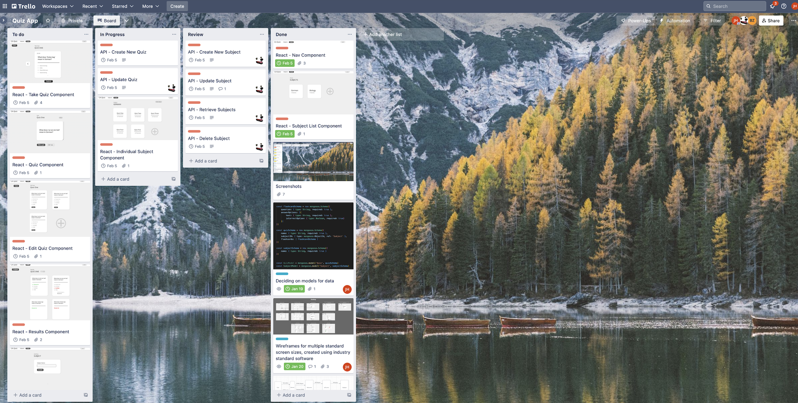
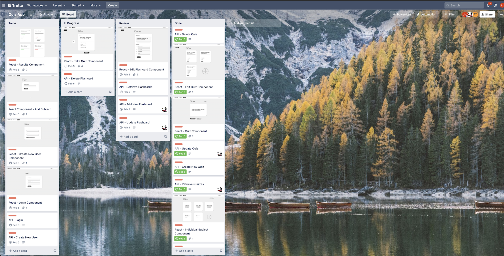
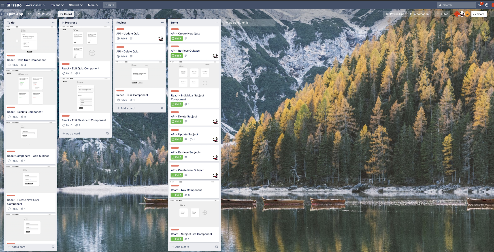
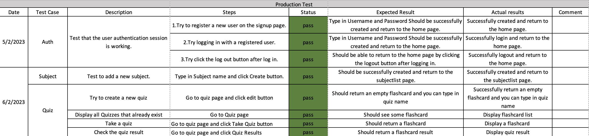

# T3A2 Part B

## GitHub Repositories

[Front-end GitHub](https://github.com/jfhaines/ca-quiz-front-end)

[Back-end GitHub](https://github.com/2w00fs/ca_quiz_api)

## Deployment Links

front end: https://quiz.2webs.au/

back end: https://ca-quiz-api-nvlgfujpga-ts.a.run.app/

api-docs: https://ca-quiz-api-nvlgfujpga-ts.a.run.app/api-docs

## Project Management

[Trello Link](https://trello.com/b/PIz5SScS/quiz-app)

## Testing

Automated tests are provided in both the frontend and backend repositories.

## Libraries Used

### Libraries - API

### Express

Creates a basic HTTP server that listens for requests. The endpoints of these requests allow data to be received or
returned, becoming the interface of the API.

#### lodash

Used for accurate type checking, and checking input for empty values

#### swagger-ui-express

Provides a UI for the api-docs that were created.
Allows API calls to be made through the interface, and gives a description of parameters and expected output.

#### express-validator

A library to sanitise input before it is parsed and sent to the database or back to the user.

#### Mongoose

Mongo ORM to interact with the database. Used to create schemas and perform CRUD operations.

#### passport-local-mongoose + jsonwebtoken + bcrypt

These tools combined allowed user authentication to be developed. Passport-local-mongoose
handles the user information between the app and the database, bcrypt creates a hash of the password for data security.
jsonwebtoken allows the users current state to be managed.

#### jest

A library that allows tests to be created by specifying what the input is, and what the expected output should be.
A comparison is made between the two and any discrepancies are flagged.

#### supertest

Makes API calls on behalf of the user when a test is ran.

### Libraries - Front End

#### react-router

Creates a seamless experience when using web applications.
A user can make changes to a webpage and send or request data to an API without the browser reloading the page.
Creates a schema-like layout within the source code to map routes to the elements that will be loaded.

### React

Used to create and render the interface of the application.
Parts of the UI can be updated without refreshing the whole browser screen, creating a user experience that looks and
feels like a desktop app, but in the browser.